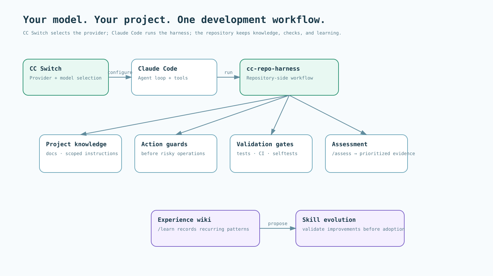
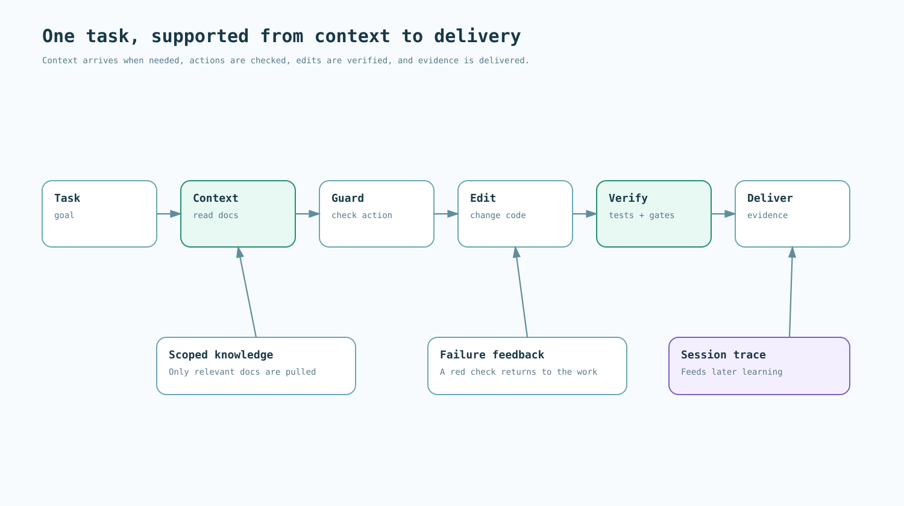

<div align="center">


# cc-repo-harness

**Choose your model. Keep the Claude Code harness.**

Give your chosen model the same project knowledge, working rules, and verification workflow. A Claude Code plugin and repository template, with CC Switch as the default provider setup.

[Quick start](#quick-start) · [Use the template](https://github.com/WangChangxin0809/cc-repo-harness-template) · [Guides](docs/index.md)

[](https://github.com/WangChangxin0809/cc-repo-harness/actions/workflows/ci.yml)
[](https://github.com/WangChangxin0809/cc-repo-harness/releases)
[](https://code.claude.com/docs/en/plugins)
[](LICENSE)

</div>

**Default setup: CC Switch + Claude Code + cc-repo-harness.**

[CC Switch](https://github.com/farion1231/cc-switch) configures your model provider. Claude Code runs the agent loop and tools. cc-repo-harness equips the repository with knowledge, action guards, validation, and learning.

Your repository can do more than hold code. It can direct an agent to the right documentation, check its changes, and preserve what the team learns.

**cc-repo-harness brings these pieces together:** assess an existing project, add the missing foundations, and turn recurring session patterns into reviewable improvements. The resulting rules, checks, and project knowledge live alongside your code.

## What you get

| Goal | How the harness helps |
|---|---|
| **Switch models, keep the workflow** | Use CC Switch to configure a supported provider while keeping Claude Code and the same repository-side setup. |
| **Know what to improve next** | `/assess` combines scripted evidence with agent review to produce prioritized findings and concrete next steps. |
| **Put rules into the workflow** | Guards check proposed actions; gates check the worktree; selftests exercise the failure cases those checks should catch. |
| **Give agents the right context** | A document index, directory-scoped instructions, and edit-time context delivery connect project knowledge to the work at hand. |
| **Turn sessions into reusable knowledge** | `/learn` organizes recurring patterns in a shared experience wiki; `/learn --propose` can turn selected patterns into guard pull requests for review. |
| **Keep the setup with the project** | Version-controlled scripts and configuration travel with the repository. Choose the foundations that fit an existing project, or start from the template. |



## Quick start

### 1. Set up CC Switch and Claude Code

Install [Claude Code](https://code.claude.com/docs/en/quickstart) and [CC Switch](https://github.com/farion1231/cc-switch/releases/latest) on your workstation. **CC Switch is the standard model setup for this project.**

In CC Switch, select **Claude Code**, add a provider, enter its endpoint and credentials, and choose the model. The provider catalog includes presets such as DeepSeek, Kimi, GLM, and MiniMax; custom providers can use a supported API format.

For an OpenAI Chat Completions or Responses endpoint, select the matching **API Format**, start the local proxy, and enable **Claude Code takeover**. For a native Anthropic Messages endpoint, use its provider preset or direct configuration. Then start a new Claude Code session in your project.

[Provider setup, model mapping, and a tool-use check →](docs/how-to/model-setup.md)

### 2. Install the repository harness

In Claude Code, install the plugin:

```text
/plugin marketplace add WangChangxin0809/cc-repo-harness
/plugin install cc-repo-harness@wangchangxin-plugins
```

Then open a repository you trust and run:

```text
/assess
```

You get a report with findings, supporting evidence, and the change that would address each finding. The full assessment runs the repository's tests; use `/assess --no-full` to skip historical defect replay.

Follow the [improvement guide](guide/1-assess.md) to choose changes, apply them, and measure again.

### 3. Start a new project

Use [cc-repo-harness-template](https://github.com/WangChangxin0809/cc-repo-harness-template) for a repository with documentation structure, hooks, checks, CI, and an onboarding checklist already in place. Fill in the project-specific content, then make the checks your own.

### Requirements

**CC Switch**, **Claude Code with plugin support**, **Git**, and **Python 3.9+**. Bring credentials for your selected provider. The core repository scripts use the Python standard library; full assessment also needs the project's test toolchain. CC Switch is installed locally, and provider credentials stay outside the repository.

## One harness, multiple model backends

**CC Switch chooses the connection. Claude Code provides the execution harness. The repository keeps the workflow.**

| Layer | Responsibility |
|---|---|
| **CC Switch** | Provider configuration, model selection, and supported API translation through its local proxy. |
| **Claude Code** | Sessions, tool calls, permissions, hooks, and agent execution. |
| **cc-repo-harness** | Repository knowledge, guards, gates, assessment, and learning workflows. |

Select the endpoint and API format that match your provider. Tool use, vision, context limits, and other capabilities depend on the chosen model and connection; use the [setup check](docs/how-to/model-setup.md#verify-tool-use) before running a full assessment.

## Three ways to use it

### 1. Assess → improve → measure again

Five dimensions give you a working picture of the repository:

| Dimension | What it examines |
|---|---|
| **Execution** | Available actions and protection against destructive work. |
| **Validation** | Whether defects are caught, and where feedback arrives. |
| **Delivery** | Whether verification is required before changes land. |
| **Memory** | Documentation references, consistency, and usefulness. |
| **Context economy** | The size and placement of standing instructions. |

Scripts collect the measurements. Agent readers interpret the evidence and explain their scores; repeated readings surface disagreements. Use the findings to choose an improvement, then compare the underlying measurements after the change.

[Explore the assessment workflow →](commands/assess.md)

### 2. Build the foundations your project needs

The scaffolder adds missing pieces around your existing files and merges hook configuration. Three tiers let you choose the scope:

**A · Essentials:** project instructions, documentation routing, and action guards.  
**B · Working feedback:** gates, context hooks, experience-wiki seeds, and authoring guidance.  
**C · Larger repositories:** code-navigation tooling and a repository explorer.

The installed scripts run from your repository, so teammates using the same host and configuration can use them without installing the scaffolding plugin.

[See how the pieces fit together →](ARCHITECTURE.md)



### 3. Learn from the work already done

Run this in a repository with local Claude Code session history:

```text
/learn
```

Review the recurring patterns it records under `.claude/wiki/`. When a pattern warrants a new guard:

```text
/learn --propose
```

The proposal workflow evaluates the candidate against recorded tool calls and can open a pull request. You review the change before it becomes part of the team's workflow.

[Explore the learning workflow →](commands/learn.md)

## Shared project memory

Keep project decisions and lessons in Git so the next session can recall relevant knowledge with its sources. `remember` saves private candidates; `propose` and `apply` produce checked repository changes for the team's review and merge. `recall`, `verify`, `forget`, and `sync` maintain the local view.

`dream prepare` freezes selected inputs for bounded, agent-assisted synthesis; `dream finish` checks the resulting private proposal before it can enter the same review path.


[Use shared memory →](docs/how-to/shared-memory.md) · [Archify source and reproduction →](docs/reference/diagram-gallery.md#reproduce-the-shared-memory-diagram)

## Collaboration and skill evolution

**Implementation preview · integration and host validation in progress.** The next layer connects parallel agents and evidence-driven learning to the same repository workflow.

**Coordinate work:** shared room state, file claims, messages, and version-aware editing.  
**Improve reusable skills:** propose changes from execution experience, compare them on validation tasks, and retain improvements.  
**Publish project knowledge:** maintain reviewed sources and cited answers, with documentation built from approved content.  
**Evaluate parallel work:** compare task outcomes, elapsed time, and cost alongside coordination readiness.

The preview is opt-in and not installed by the quick start above. Read the [AgentRoom runtime](docs/reference/agentroom-v3.md), [WikiSkill evolution lane](docs/how-to/wikiskill-v3.md), [reviewed knowledge lane](docs/reference/knowledge-v3.md), and [concurrency assessment annex](docs/reference/concurrency-v3.md). The [collaboration plan](docs/exec-plans/collaboration-harness/README.md) and [field trial](docs/exec-plans/field-trial/README.md) track the broader direction.

## Explore the mechanisms

[Visual guide](docs/reference/diagram-gallery.md) · [Model setup](docs/how-to/model-setup.md) · [Architecture](ARCHITECTURE.md) · [Documentation](docs/index.md) · [When instructions reach the agent](skills/bootstrap-repo-harness/references/moments.md) · [Improve a repository](guide/1-assess.md)

## Trust and operation

Run assessments and repository hooks only in checkouts you trust. For repository guards that the plugin invokes before local wiring exists, approval is recorded per checkout and guard content; edits require renewed approval. Guards complement host permissions and server-side branch protection. See [SECURITY.md](SECURITY.md) and the [trust hook](hooks/run_repo_guards.py) for setup and execution boundaries.

## Contributing

See [CONTRIBUTING.md](CONTRIBUTING.md). To check a local checkout:

```bash
python3 scripts/check.py
```

## License

[MIT](LICENSE).
