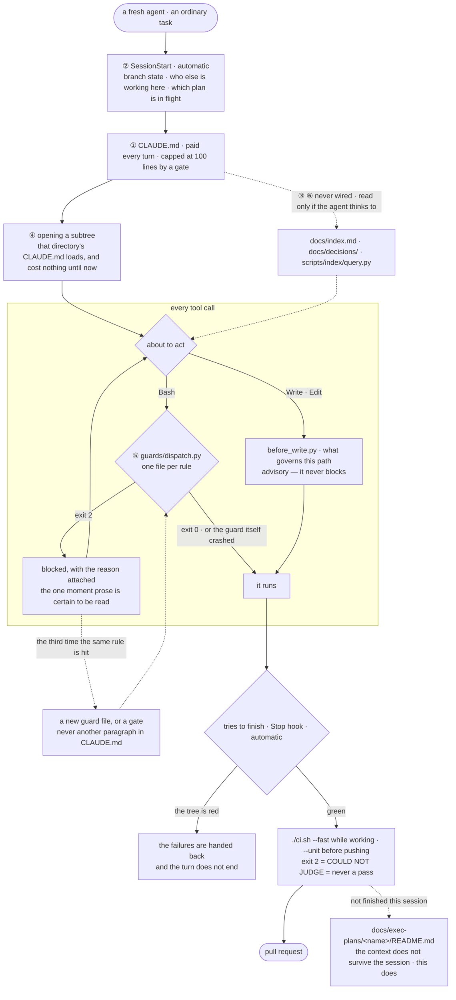

# repo-agent-harness

**A repository-side harness for coding agents.** It lays the foundation which
makes a repository teach coding agents how to work in it — and then becomes
unnecessary.

The acceptance test is literal: install it, run the bootstrap, **uninstall the
plugin**, hand a fresh agent a real task, and the repository must still teach it
the conventions. Everything the plugin installs lives in the target repository —
`CLAUDE.md`, `.claude/settings.json`, `docs/`, `scripts/` — under version
control, reviewable in a pull request, and working for teammates who have never
heard of this plugin.

### Scope, stated so the name cannot overclaim

*Harness* is an overloaded word, and the two meanings are worth separating
before the first command:

- **This is not the agent's execution loop.** In the Claude Agent SDK, "harness"
  names the runtime that drives a model through tool calls. Nothing here touches
  that. This is the *other* side: the repository the loop is pointed at.
- **What it is:** conventions, guards, gates, and retrieval, placed in the
  repository at the moments an agent actually reads them. It changes what the
  repository tells an agent, never how the agent runs.
- **What it is not:** an evaluation framework, a model router, a memory system,
  or anything that persists outside version control.

## Install

```bash
/plugin marketplace add WangChangxin0809/repo-agent-harness
/plugin install repo-agent-harness@wangchangxin-plugins
```

If you added the marketplace under the old name `WangChangxin0809/agent-harness`,
it keeps working — GitHub serves a permanent redirect for both the web URL and
`git clone`. Nothing needs to be re-added.

From a local clone instead, point the first line at the checkout directory —
the marketplace manifest is at `.claude-plugin/marketplace.json`.

Then, in the repository you want to set up: *"set this repo up so the rules
actually get enforced"* — or invoke `bootstrap-repo-harness` directly.

## What is in it

| Skill | Enter it when |
|---|---|
| `bootstrap-repo-harness` | Once, to lay the foundation |
| `writing-docs` | Every time you write or restructure a document |
| `writing-checks` | Every time a rule needs enforcing rather than documenting |
| `writing-github-docs` | README, CONTRIBUTING, and the community health files |
| `repo-index` | Large repo; an agent cannot find the relevant code |
| `consolidating-notes` | Notes have accumulated, drifted, or contradicted |

Plus one subagent (`repo-explorer`, small model, own context) and one hook that
runs a repository's own guards during the window before it has wired them — see
[Trust](#trust), because that hook executes code from the repository and
therefore asks first.

## The argument

Knowledge only changes behaviour if it arrives at the moment of acting. A
repository has seven such moments and each has a different cost and reach; most
repositories use one of them — a `CLAUDE.md` that is paid on every turn, read
once, and followed unevenly.

Two rules follow, and everything else is detail:

- **Knowledge lives in the repository, not in agent memory.** Memory is
  per-machine, invisible to review, and cannot be corrected by a teammate.
- **What cannot tolerate a miss never goes through retrieval.** Retrieval is
  best-effort by construction. Rules whose violation is irreversible or silent
  become a guard that blocks the action or a gate that fails the build.

And the correction that keeps the second rule honest: **a guard is a speed bump,
not a boundary.** It matches command text and it fails open by design, so
`B=push; git $B origin main` walks straight past it. For a rule that genuinely
cannot tolerate a miss, the guard is the third line — after `permissions.deny`
and after server-side branch protection. What it adds is the paragraph
explaining why, delivered at the moment of the attempt, which is the one place
prose is guaranteed to be read.

## A day in a repository that has it

The bootstrap is a morning's work and it happens once. This is what the months
after it look like: a fresh agent, an ordinary task, and what reaches it at each
moment. **Solid arrows are wired and automatic. Dashed arrows are the agent's
own initiative** — moments 3 and 6 are never wired by the scaffolder, so
retrieval and the decision record are read because an agent thought to, or not
at all.



The loop in the bottom right is the only part that compounds. Everything else
holds a line that was already drawn; that one is how a new line gets drawn —
a rule that keeps being hit stops being prose and becomes a file, and the
harness a repository has two years in is mostly made of those.

## Trust

The plugin's `PreToolUse` hook runs `scripts/guards/dispatch.py` from whatever
repository you are in, and that dispatcher imports every `.py` beside it. Left
ungated, cloning an unread repository and typing one command would execute its
code — laundered through an approval you gave to *this* plugin, bypassing the
prompt Claude Code shows for a project's own hooks.

So nothing runs until you trust it, by path and by content:

```bash
python3 hooks/run_repo_guards.py --status   # what is trusted here, and why not
python3 hooks/run_repo_guards.py --trust    # after reading the files it lists
python3 hooks/run_repo_guards.py --forget
```

Editing any guard revokes trust until you look again. Trust is per-machine
state, not knowledge, so it lives in `~/.claude/repo-agent-harness/` — a repository
that could grant itself trust in a pull request would not be granting anything.

The better answer is to skip this hook entirely: once `scripts/guards/dispatch.py`
is wired in the repository's own `.claude/settings.json` — which `scaffold.py`
does for you — the repo owns its guards, the normal project-trust prompt
applies, and this hook exits silently. It exists only for the window in between.

**Cost**: an interpreter start (~45 ms) before every Bash call in every
repository the plugin is enabled for, doubled in the trusted-but-unwired window.
Wiring the dispatcher into the repo removes the second one. The first is the
price of a plugin hook and cannot be optimised away from inside it.

## Verifying the plugin itself

```bash
python3 shared/scripts/guards/selftest.py
python3 shared/scripts/gates/selftest.py --verbose

# and the gates that ship, turned on this repository
python3 shared/scripts/gates/check_templates_filled.py --root .
python3 shared/scripts/gates/check_community_health.py --root .
```

The selftests build throwaway repositories, plant a defect each check must
catch, and assert the check turns red **and names the defect** — then that it
turns green without it. A check nobody has watched fail is a file, not a check.

The second pair matters for a different reason. `check_templates_filled.py`
exists because the version of this plugin that shipped before it could not
detect its own scaffolder's output: a `CLAUDE.md` of twenty `<placeholder>`
lines passed every gate here, including the one whose stated job was to catch
it. Pointing the shipped gates at this repository is the cheapest way to keep
finding out that the thing was built for a repository nobody actually has.

## Requirements

- Python 3.9+ (standard library only — no dependencies)
- git
- Claude Code with plugin support

No optional dependencies either. The index extracts symbols with per-language
regexes, and `docs/generated/index-report.md` records the holes that leaves —
the files it skipped, the imports it could not resolve, the dispatch it cannot
see. Read that before trusting an absence in the graph.

This section used to promise that installing `tree-sitter-languages` upgraded
extraction. It did not, and the report said `tree-sitter` anyway — see
[0003](docs/decisions/0003-the-extractor-is-regexes-and-says-so.md) for what
that broke and what it would take to build the extractor for real.

## Contributing

See [CONTRIBUTING.md](CONTRIBUTING.md). Security issues go to
[SECURITY.md](SECURITY.md), not the issue tracker.

## License

MIT — see [LICENSE](LICENSE).
