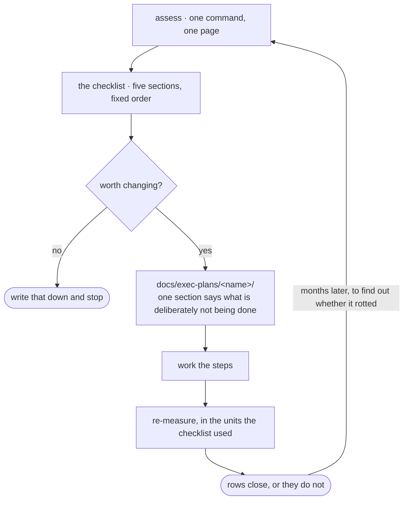

<div align="center">


# repo-agent-harness

**A repository-side harness for coding agents — and the instrument that tells you
whether it is still holding.**

[](https://github.com/WangChangxin0809/repo-agent-harness/actions/workflows/ci.yml)
[](LICENSE)
[](#requirements)
[](#requirements)

</div>

It does three things:

| | | Start with |
|---|---|---|
| **Scaffold** | lay the foundation in a repository that has none | `bootstrap-repo-harness` |
| **Assess** | measure a repository that already exists, on five dimensions | `/assess` |
| **Improve** | work what the assessment found, then re-measure in the same units | [the guide](guide/1-assess.md) |

> [!NOTE]
> **The repository keeps the harness; the plugin keeps the instrument.** Everything
> the scaffold writes lands in your repository under version control, reviewable in
> a pull request, working for teammates who never installed this. Uninstalling costs
> you the measurement, never the machinery.

## Install

```bash
/plugin marketplace add WangChangxin0809/repo-agent-harness
/plugin install repo-agent-harness@wangchangxin-plugins
```

Installing changes nothing on its own. The first session in a repository gets one
paragraph — standing per-turn cost, which delivery moments are wired, what checks
exist — and then never speaks again. It reads files and asks git for a list; it
executes nothing.

## Scaffold

In the repository you want set up: *"set this repo up so the rules actually get
enforced"*, or invoke `bootstrap-repo-harness` directly.

A repository has seven moments where knowledge can reach an agent, each with a
different cost and reach. Most use one — a `CLAUDE.md` paid on every turn, read
once, followed unevenly. The scaffold places conventions, guards, gates and
retrieval at the moments an agent actually reads them.

Two rules decide what goes where:

- **Knowledge lives in the repository, not in agent memory.** Memory is
  per-machine, invisible to review, and no teammate can correct it.
- **What cannot tolerate a miss never goes through retrieval.** Retrieval is
  best-effort by construction. A rule whose violation is irreversible or silent
  becomes a guard that blocks the action or a gate that fails the build.

> [!WARNING]
> **A guard is a speed bump, not a boundary.** It matches command text and fails
> open by design, so `B=push; git $B origin main` walks straight past it. For a
> rule that genuinely cannot tolerate a miss, the guard is the third line — after
> `permissions.deny` and after server-side branch protection. What it adds is the
> paragraph explaining why, delivered at the moment of the attempt.

<details>
<summary><b>What the repository ends up with</b> — every path under version control, working with this plugin uninstalled</summary>

`◆` is written by `scaffold.py`, `◇` is authored by hand because nothing can
generate it, and **A/B/C is the tier that installs it.** Installing above tier
leaves machinery nobody needs.

```
repo/
├── CLAUDE.md                  ◆ A  cap 100 lines, gate-enforced · moment 1
├── ARCHITECTURE.md            ◇ B  bird's eye · codemap · invariants
├── SECURITY.md                ◆ B  how to report; the rules live in the checks
├── ci.sh                      ◆ B  the one acceptance entry · three lanes
│
├── .claude/                        wiring only — never knowledge
│   ├── settings.json          ◆ A  each hook is one line calling scripts/
│   └── guards.json            ◆ A  protected branches · layers · exceptions
│
├── src/<subtree>/CLAUDE.md    ◇ B  loads only when that subtree is read · moment 4
│
├── docs/
│   ├── index.md               ◆ A  routing table: task → read → edit
│   ├── how-to/  reference/    ◇ A  action → command → criterion · lookup tables
│   ├── troubleshooting/       ◇ B  symptom → cause → action
│   ├── decisions/             ◆ B  numbered · immutable · superseded, never edited
│   ├── exec-plans/<name>/     ◇ B  README owns the state, steps own the substance
│   └── generated/             ◇ B  regenerate, then git diff must be empty
│
└── scripts/                        judgement — every pass/fail decision
    ├── guards/                ◆ A  one proposed action, before it runs
    │   ├── dispatch.py             add a rule = add a file · fails open
    │   ├── selftest.py             must be seen failing before you trust it
    │   └── no_*.py                 three universal starters
    ├── gates/                 ◆ B  the worktree, at CI time
    ├── context/               ◆ B  what the hooks call · moments 2 and 6
    ├── selftests/ baselines/  ◇ B  one per gate you add · readings record a commit
    └── index/                 ◆ C  build.py · query.py, plus a gold set
```

`CLAUDE.md` and `ARCHITECTURE.md` are the two nothing can generate, and the two
people skip. Full annotated tree:
[`references/target-architecture.md`](skills/bootstrap-repo-harness/references/target-architecture.md).

</details>

## Assess

`/assess` measures a repository and writes one page. It is one command and one
answer: five probes run, an agent reads what the probes cannot, and the step ends
when there is a checklist.

The agent is handed the numbers rather than asked for them — a model cannot count
tokens and will not produce the same figure twice, and if it produced them, then
comparing before with after would compare two opinions.

The checklist has a fixed shape, so two assessments can be compared. Five sections
in the order in which ignoring something costs you:

| | Section | Means |
|---|---|---|
| 1 | **Irreversible** | work can be destroyed. Nothing below matters until this is empty |
| 2 | **Silent** | wrong, and produces no symptom |
| 3 | **Late** | caught at CI, or never |
| 4 | **Expensive** | paid every turn and not earning it |
| 5 | **Fine** | present, correct, deliberately left alone |

One row per finding — *finding · evidence · proposed change · basis*:

| Finding | Evidence | Proposed change | Basis |
|---|---|---|---|
| Deleting tracked work is not refused | the `rm -rf` probe walked through | a guard | measured |

**Basis** is `measured` or `judged`, never blank, and a *judged* row must quote.
A section with nothing in it says *none* — a result, not a gap to go and fill.

> [!TIP]
> Two endings are outcomes, not failures. **"Nothing here is worth changing"** gets
> written down. And **`cannot judge`** is a branch, not a score — a repository whose
> tests will not run here abstains rather than scoring zero.

## Improve

Five stages, one file each:
[assess](guide/1-assess.md) ·
[write the checklist](guide/2-checklist.md) ·
[decide](guide/3-decide.md) ·
[do the work](guide/4-do-the-work.md) ·
[re-measure](guide/5-re-measure.md)

Stage 5 is why stage 1 exists: re-measuring in the units the checklist was written
in is what turns a row into closed or still open.



<details>
<summary><b>A day in a repository that has it</b> — what reaches a fresh agent, and when</summary>

**Solid arrows are wired and automatic. Dashed arrows are the agent's own
initiative** — moments 3 and 6 are never wired by the scaffolder.


The loop on the right is the only part that compounds: a rule that keeps causing
trouble stops being prose and becomes a file. The harness a repository has two
years in is mostly made of those.

</details>

## Skills

| Skill | Enter it when | Lives in |
|---|---|---|
| `bootstrap-repo-harness` | Once, to lay the foundation | the plugin |
| `writing-docs` | Writing or restructuring a document | your repo |
| `writing-checks` | A rule needs enforcing rather than documenting | your repo |
| `writing-github-docs` | README, CONTRIBUTING, community health files | your repo |
| `repo-index` | Large repo; an agent cannot find the relevant code | your repo |
| `consolidating-notes` | Notes have drifted or contradicted | your repo |

Only the first is charged to every session on your machine. The other five are
copied into the repository at the tier that earns them, so they cost nothing until
a repository asks for them and they survive uninstalling this.

Also included: two subagents with their own context (`repo-explorer`,
`repo-assessor`), and two hooks — the once-per-repository notice, and one that runs
a repository's own guards before it has wired them.

## Trust

> [!IMPORTANT]
> That second hook runs `scripts/guards/dispatch.py` from whatever repository you
> are in, and that dispatcher imports every `.py` beside it. Ungated, cloning an
> unread repository and typing one command would execute its code — laundered
> through an approval you gave to *this* plugin.

So nothing runs until you trust it, by path and by content:

```bash
python3 hooks/run_repo_guards.py --status   # what is trusted here, and why not
python3 hooks/run_repo_guards.py --trust    # after reading the files it lists
python3 hooks/run_repo_guards.py --forget
```

Editing any guard revokes trust until you look again. Trust is per-machine state,
so it lives in `~/.claude/repo-agent-harness/` — a repository that could grant
itself trust in a pull request would not be granting anything.

Better still, skip this hook: once `scripts/guards/dispatch.py` is wired into the
repository's own `.claude/settings.json` — which `scaffold.py` does for you — the
repo owns its guards, the normal project-trust prompt applies, and this hook exits
silently. It exists only for the window in between.

**Cost:** an interpreter start (~45 ms) before every Bash call, doubled in the
trusted-but-unwired window.

## Verifying the plugin itself

```bash
python3 scripts/check.py                    # everything CI runs, ~77s
python3 shared/scripts/guards/selftest.py
python3 shared/scripts/gates/selftest.py --verbose
```

The selftests build throwaway repositories, plant a defect each check must catch,
and assert the check turns red **and names the defect** — then that it turns green
without it. A check nobody has watched fail is a file, not a check.

## Requirements

- **Python 3.9+** — standard library only, no dependencies, none optional
- **git**
- **Claude Code** with plugin support

> [!NOTE]
> This is not the agent's execution loop. In the Claude Agent SDK, *harness* names
> the runtime that drives a model through tool calls; nothing here touches that.
> This is the other side — the repository that loop is pointed at. It changes what
> the repository tells an agent, never how the agent runs.

The index extracts symbols with per-language regexes, and `scripts/index/build.py`
writes what that leaves out to `docs/generated/index-report.md`. Read it before
trusting an absence in the graph.

## Contributing

See [CONTRIBUTING.md](CONTRIBUTING.md). Security issues go to
[SECURITY.md](SECURITY.md), not the issue tracker.

## License

MIT — see [LICENSE](LICENSE).
