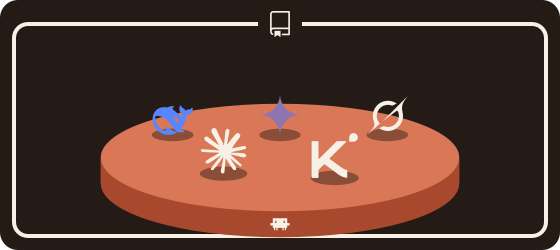
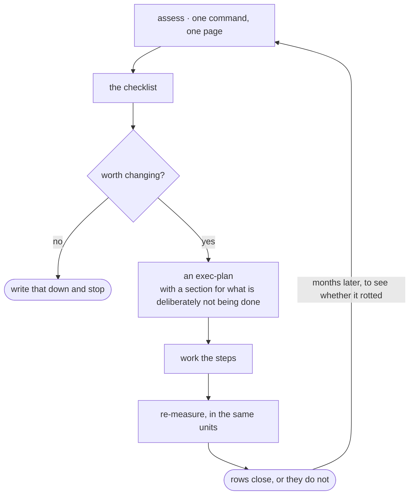

<div align="center">



# cc-repo-harness

**Measure a repository as a place for a coding agent to work, and lay the
foundation where it has none.**

[](https://github.com/WangChangxin0809/cc-repo-harness/actions/workflows/ci.yml)
[](LICENSE)
[](#requirements)
[](#requirements)

</div>

A coding agent reads `CLAUDE.md` on every turn and still repeats the same
mistake, because a paragraph is advice and advice gets skipped. This plugin puts
each rule where it actually takes effect: a hook that blocks the command, a
check that fails the build, a document that loads only when the agent opens that
directory. Then it measures, in numbers you can take again later, whether the
setup is earning what it costs on every turn.

It works on the repository side. It changes what a repository tells an agent,
never how the agent runs. The Claude Agent SDK also uses the word *harness*, for
the loop that drives a model through tool calls; nothing here touches that.

| | | You type | Status |
|---|---|---|---|
| **Assess** | measure a repository that already exists | `/assess` | complete |
| **Improve** | work what the assessment found, then measure again | [the guide](guide/1-assess.md) | early |
| **Scaffold** | lay the foundation in a repository that has none | `bootstrap-repo-harness` | early |

The assessment is the finished part of this release: five dimensions, every
number produced by a script, a page you can take again after a change. The
improve guide and the scaffold work today, and they are the parts most likely
to change shape.

Everything the scaffold writes lands in your repository, under version control,
reviewable in a pull request. Teammates who never installed the plugin get the
same behaviour. Uninstalling removes the measurement and nothing else.

## Quick start

```bash
/plugin marketplace add WangChangxin0809/cc-repo-harness
/plugin install cc-repo-harness@wangchangxin-plugins
```

Installing runs nothing in your repository. The first session in each repository
prints one paragraph about what it has and lacks, and after that the plugin is
silent until asked.

Then, in a repository: `/assess` measures it as it is. To scaffold one that
has nothing yet, say *"set this repo up so the rules actually get enforced"*.

## Assess

`/assess` runs the instrument, hands its numbers to an agent, and ends with one
page. Five dimensions, each answering one question:

| | Dimension | Question |
|---|---|---|
| 1 | **Execution** | What can an agent do here, and is destroying work refused? |
| 2 | **Validation** | How late is a defect caught? |
| 3 | **Delivery** | Is verification required before merge, or merely possible? |
| 4 | **Memory** | Is what is written down true, and worth its place? |
| 5 | **Context economy** | What does the harness cost on every turn? |

Every number is produced by a script, never estimated by the model, so a figure
taken today can be compared with the same figure after a change. Then one
reader per dimension, twice, puts each sub-item on a ten and names the one
change that would move it. The page opens with those changes, lowest score
first:

| | | Moves if |
|---|---|---|
| 1.1 | 3 | a guard on `git reset --hard`, the one probe that walked through |
| 3.2 | 5 | a required check on `main`; today the suite runs and nothing waits for it |

Two readers more than two points apart on a row are shown as disagreeing,
not averaged. Two endings are results, not failures: *nothing here is worth
changing* is an empty list, written down. And a repository whose tests will
not run on this machine abstains from that dimension instead of scoring zero,
while a repository with no tests at all gets the red row it earned.

## Improve

The guide, five files in order:
[assess](guide/1-assess.md) ·
[write the checklist](guide/2-checklist.md) ·
[decide](guide/3-decide.md) ·
[do the work](guide/4-do-the-work.md) ·
[re-measure](guide/5-re-measure.md)

The last stage is why the first exists. Measuring again, in the units the
checklist was written in, is what turns a row into closed or still open.



## Scaffold

A repository has seven moments at which it can put something in front of an
agent: every turn, session start, each prompt, opening a subtree, before an
action, after an action, and on demand. They differ in what they cost and in
how likely the agent is to read them. Most repositories use only the first. The
scaffold moves each rule to the moment where it is cheapest and most likely to
land:

- a convention the agent should know goes in `docs/`, routed from one index
- a rule whose violation is irreversible becomes a **guard**, which blocks the command
- a rule whose violation is silent becomes a **gate**, which fails the build
- the reasoning goes in a decision record, so nobody re-argues it next quarter

Two principles decide the rest. Knowledge lives in the repository, never in an
agent's memory, because memory is per-machine and no teammate can correct it.
And nothing that cannot tolerate a miss goes through retrieval, because
retrieval is best-effort by construction.

> [!WARNING]
> A guard matches command text and fails open, so `B=push; git $B origin main`
> walks straight past it. Treat it as the third line of defence, after
> `permissions.deny` and server-side branch protection. What the guard adds is
> the explanation, delivered at the moment of the attempt.

<details>
<summary><b>What lands in your repository</b> — every path under version control, working with this plugin uninstalled</summary>

`◆` is written by `scaffold.py`; `◇` is authored by hand, because nothing can
generate it. **A, B, C** is the tier that installs it: A for any repository, B
once it has CI, C once it is too large for an agent to find its way by reading.
Installing above tier leaves machinery nobody uses.

```
repo/
├── CLAUDE.md                  ◆ A  cap 100 lines, gate-enforced
├── ARCHITECTURE.md            ◇ B  bird's eye · codemap · invariants
├── SECURITY.md                ◆ B  how to report; the rules live in the checks
├── ci.sh                      ◆ B  the one acceptance entry · three lanes
│
├── .claude/                        wiring only, never knowledge
│   ├── settings.json          ◆ A  each hook is one line calling scripts/
│   └── guards.json            ◆ A  protected branches · layers · exceptions
│
├── src/<subtree>/CLAUDE.md    ◇ B  loads only when that subtree is read
│
├── docs/
│   ├── index.md               ◆ A  routing table: task → read → edit
│   ├── how-to/  reference/    ◇ A  action → command → criterion · lookup tables
│   ├── troubleshooting/       ◇ B  symptom → cause → action
│   ├── decisions/             ◆ B  numbered · immutable · superseded, never edited
│   ├── exec-plans/<name>/     ◇ B  README owns the state, steps own the substance
│   └── generated/             ◇ B  regenerate, then git diff must be empty
│
└── scripts/                        every pass/fail decision
    ├── guards/                ◆ A  one proposed action, before it runs
    │   ├── dispatch.py             add a rule = add a file · fails open
    │   ├── selftest.py             must be seen failing before you trust it
    │   └── no_*.py                 three universal starters
    ├── gates/                 ◆ B  the worktree, at CI time
    ├── context/               ◆ B  what the hooks call
    ├── selftests/ baselines/  ◇ B  one per gate you add
    └── index/                 ◆ C  build.py · query.py, plus a gold set
```

`CLAUDE.md` and `ARCHITECTURE.md` are the two nothing can generate, and the two
people skip. The annotated version, and the seven moments in full:
[`target-architecture.md`](skills/bootstrap-repo-harness/references/target-architecture.md),
[`moments.md`](skills/bootstrap-repo-harness/references/moments.md).

</details>

## What is in the plugin

| Skill | Enter it when | Lives in |
|---|---|---|
| `bootstrap-repo-harness` | Once, to lay the foundation | the plugin |
| `writing-docs` | Writing or restructuring a document | your repo |
| `writing-checks` | A rule needs enforcing rather than documenting | your repo |
| `writing-github-docs` | README, CONTRIBUTING, community health files | your repo |
| `repo-index` | Large repo; an agent cannot find the relevant code | your repo |
| `consolidating-notes` | Notes have drifted or contradicted | your repo |

Only the first is charged to every session on your machine. The other five are
copied into a repository at the tier that earns them, so they cost nothing until
then and keep working after you uninstall this.

Also included: three subagents with their own context. `repo-explorer`
answers one question about a codebase; `/assess` spawns `assess-reader` once
per dimension and the blind `assess-promise-tester` when asked. Plus the
once-per-repository notice, and a hook that runs a repository's own guards
before it has wired them itself.

## Trust

> [!IMPORTANT]
> That last hook runs `scripts/guards/dispatch.py` from whatever repository you
> are in, and the dispatcher imports every `.py` beside it. Left ungated, cloning
> an unread repository and typing one command would execute its code, through an
> approval you gave to this plugin.

So nothing runs until you have trusted it, by path and by content:

```bash
python3 hooks/run_repo_guards.py --status   # what is trusted here, and why not
python3 hooks/run_repo_guards.py --trust    # after reading the files it lists
python3 hooks/run_repo_guards.py --forget
```

Editing any guard revokes trust until you look again. Trust is per-machine state
in `~/.claude/cc-repo-harness/`, never in the repository.

Once the repository wires `dispatch.py` into its own `.claude/settings.json`,
which the scaffold does for you, the normal project-trust prompt applies and
this hook exits silently. It exists only for the window in between. Cost: one
interpreter start, about 45 ms, before every Bash, Write and Edit call.

## Requirements

- **Python 3.9+**, standard library only, no dependencies
- **git**
- **Claude Code** with plugin support

## Developing the plugin

```bash
python3 scripts/check.py            # everything CI runs, about a minute
python3 scripts/check.py --list     # what that is, and what this machine skips
```

The selftests build throwaway repositories, plant a defect each check must
catch, and assert the check turns red and names it. A check nobody has watched
fail is a file, not a check.

## Contributing

See [CONTRIBUTING.md](CONTRIBUTING.md). Security issues go to
[SECURITY.md](SECURITY.md), not the issue tracker.

## License

MIT. See [LICENSE](LICENSE).
