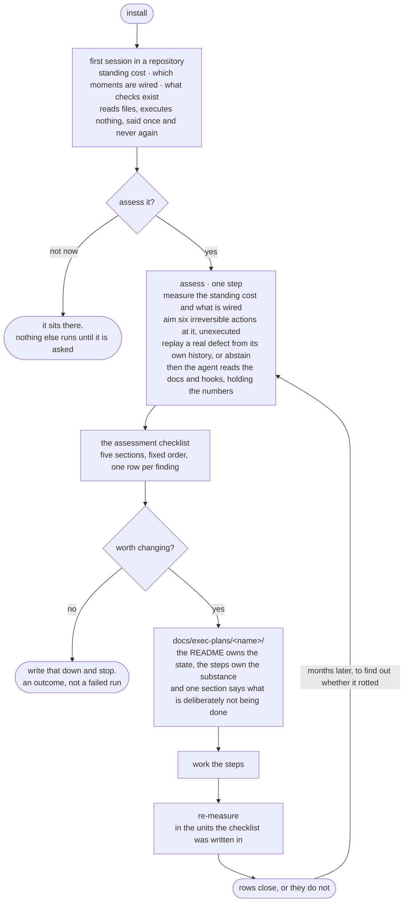

# repo-agent-harness

**A repository-side harness for coding agents, and an instrument for checking
it later.** It lays the foundation that makes a repository teach coding agents
how to work in it — then stays around to tell you whether that foundation is
still holding.

Two halves, and which half lives where is the whole architecture:

**The repository keeps the harness.** Everything the bootstrap installs lives in
the target repository — `CLAUDE.md`, `.claude/settings.json`, `docs/`,
`scripts/` — under version control, reviewable in a pull request, working for
teammates who have never heard of this plugin. The acceptance test is literal:
**uninstall the plugin**, hand a fresh agent a real task, and the repository
must still teach it the conventions.

**The plugin keeps the instrument.** `assess/` is a diagnostic, so it is never
copied into anybody's tree. Run it in three months and it answers the question
a harness cannot answer about itself: has the standing per-turn cost crept up,
are defects that used to be refused before the write now reaching CI, have
documents fallen behind the code they claim. Uninstalling costs you the
measurement, never the machinery — which is why the uninstall test is about
independence rather than about being done with it.

### Scope, stated so the name cannot overclaim

*Harness* is an overloaded word, and the two meanings are worth separating
before the first command:

- **This is not the agent's execution loop.** In the Claude Agent SDK, "harness"
  names the runtime that drives a model through tool calls. Nothing here touches
  that. This is the *other* side: the repository the loop is pointed at.
- **What it is:** conventions, guards, gates, and retrieval, placed in the
  repository at the moments an agent actually reads them. It changes what the
  repository tells an agent, never how the agent runs.
- **What it is not:** an evaluation framework, a model router, a memory system,
  or anything that persists outside version control.

## Install

```bash
/plugin marketplace add WangChangxin0809/repo-agent-harness
/plugin install repo-agent-harness@wangchangxin-plugins
```

If you added the marketplace under the old name `WangChangxin0809/agent-harness`,
it keeps working — GitHub serves a permanent redirect for both the web URL and
`git clone`. Nothing needs to be re-added.

From a local clone instead, point the first line at the checkout directory —
the marketplace manifest is at `.claude-plugin/marketplace.json`.

Then, in the repository you want to set up: *"set this repo up so the rules
actually get enforced"* — or invoke `bootstrap-repo-harness` directly.

## What is in it

| Skill | Enter it when |
|---|---|
| `bootstrap-repo-harness` | Once, to lay the foundation |
| `writing-docs` | Every time you write or restructure a document |
| `writing-checks` | Every time a rule needs enforcing rather than documenting |
| `writing-github-docs` | README, CONTRIBUTING, and the community health files |
| `repo-index` | Large repo; an agent cannot find the relevant code |
| `consolidating-notes` | Notes have accumulated, drifted, or contradicted |

Plus one subagent (`repo-explorer`, small model, own context) and two hooks:
the once-per-repository notice described below, and one that runs a repository's
own guards during the window before it has wired them — see [Trust](#trust),
because that second one executes code from the repository and therefore asks
first.

## The argument

Knowledge only changes behaviour if it arrives at the moment of acting. A
repository has seven such moments and each has a different cost and reach; most
repositories use one of them — a `CLAUDE.md` that is paid on every turn, read
once, and followed unevenly.

Two rules follow, and everything else is detail:

- **Knowledge lives in the repository, not in agent memory.** Memory is
  per-machine, invisible to review, and cannot be corrected by a teammate.
- **What cannot tolerate a miss never goes through retrieval.** Retrieval is
  best-effort by construction. Rules whose violation is irreversible or silent
  become a guard that blocks the action or a gate that fails the build.

And the correction that keeps the second rule honest: **a guard is a speed bump,
not a boundary.** It matches command text and it fails open by design, so
`B=push; git $B origin main` walks straight past it. For a rule that genuinely
cannot tolerate a miss, the guard is the third line — after `permissions.deny`
and after server-side branch protection. What it adds is the paragraph
explaining why, delivered at the moment of the attempt, which is the one place
prose is guaranteed to be read.

## What happens after you install it

Installing changes nothing. The first session in a repository gets one
paragraph — the standing per-turn cost, which of the seven delivery moments are
wired, what checks exist — and then never speaks again in that repository. That
paragraph reads files and asks git for a list; it executes nothing, because the
rest of the assessment fires a repository's own hooks and runs its test suite,
and doing either because somebody installed a plugin helps itself to a machine
that was never offered.



Four things the shape is arguing.

**Assessing is one step, not a procedure.** It runs five probes and it is still
one command and one answer, because which probes ran is this plugin's business
and not the reader's. The step ends when there is a checklist, and the only
thing between the command and the checklist is an agent reading.

**The agent is in that step, and it is handed the numbers rather than asked for
them.** It reads what the probes cannot: whether the standing context earns its
tokens or restates the file next to it, which sentences are waffle, whether each
wired hook addresses a mistake *this* repository actually makes. It does not
count, because a model cannot count tokens, will not produce the same figure
twice, and — the part that matters — if the agent produces the numbers then
comparing before with after compares two opinions.

**The checklist has a fixed shape, so two assessments can be compared.** Five
sections in one order — the order in which ignoring something costs you:

| | Section | Means |
|---|---|---|
| 1 | **Irreversible** | work can be destroyed. Nothing below matters until this is empty |
| 2 | **Silent** | wrong, and produces no symptom |
| 3 | **Late** | caught at CI, or never |
| 4 | **Expensive** | paid every turn and not earning it |
| 5 | **Fine** | present, correct, deliberately left alone |

One row per finding: *finding · evidence · proposed change · basis*.

| Finding | Evidence | Proposed change | Basis |
|---|---|---|---|
| Deleting tracked work is not refused | the `rm -rf` probe walked through | a guard | measured |
| 612 tokens/turn restate the directory layout | `CLAUDE.md:14-31`, against `docs/index.md` | cut to the routing table | judged |

**Basis** is `measured` or `judged`, never blank, and a **judged** row must
quote. A claim you cannot quote is one nobody can check, and "the docs are
verbose" has never once caused a deletion. A section with nothing in it says
*none* — that is a result, not a gap to go and fill.

**"Nothing here is worth changing" is an outcome.** It is written down, not
treated as a run that failed to find work. A harness that cannot say *this is
theirs, and it is fine* will rewrite everything it touches — and in this
plugin's corpus, seventeen of twenty repositories have no `Requirements` section
in their README, which is a fact about README conventions rather than seventeen
defects.

**`cannot judge` is a branch, not a score.** A repository whose tests will not
run here abstains; it never scores zero. Scoring a missing toolchain as a
failure is how an instrument starts lying, and it discards exactly the
repositories whose suites are fine.

## What the repository ends up with

Every path below is in the target repository, under version control, working
with this plugin uninstalled. `◆` is written by `scaffold.py`, `◇` is authored
by hand because nothing can generate it, and **A/B/C is the tier that installs
it** — installing above tier leaves machinery nobody needs, and its rot teaches
everyone that the machinery is decorative.

```
repo/
├── CLAUDE.md                  ◆ A  cap 100 lines, gate-enforced · moment 1
├── ARCHITECTURE.md            ◇ B  bird's eye · codemap · invariants
├── SECURITY.md                ◆ B  how to report; the rules live in the checks
├── ci.sh                      ◆ B  the one acceptance entry · three lanes
│
├── .claude/                        wiring only — never knowledge
│   ├── settings.json          ◆ A  each hook is one line calling scripts/
│   └── guards.json            ◆ A  protected branches · layers · exceptions
│
├── src/<subtree>/CLAUDE.md    ◇ B  loads only when that subtree is read · moment 4
│
├── docs/
│   ├── index.md               ◆ A  routing table: task → read → edit
│   ├── how-to/  reference/    ◇ A  action → command → criterion · lookup tables
│   ├── troubleshooting/       ◇ B  symptom → cause → action
│   ├── decisions/             ◆ B  numbered · immutable · superseded, never edited
│   ├── exec-plans/<name>/     ◇ B  README owns the state, steps own the substance
│   └── generated/             ◇ B  regenerate, then git diff must be empty
│
└── scripts/                        judgement — every pass/fail decision
    ├── guards/                ◆ A  one proposed action, before it runs
    │   ├── dispatch.py             add a rule = add a file · fails open
    │   ├── _recurrence.py          counts refusals by shape, in .git/
    │   ├── selftest.py             must be seen failing before you trust it
    │   └── no_*.py                 three universal starters
    ├── gates/                 ◆ B  the worktree, at CI time
    ├── context/               ◆ B  what the hooks call · moments 2 and 6
    ├── selftests/ baselines/  ◇ B  one per gate you add · readings record a commit
    └── index/                 ◆ C  build.py · query.py, plus a gold set
```

Two of these cannot be generated and are the ones people skip. `CLAUDE.md` is
paid on every turn of every session, so it is scoped by hand — what it covers
and what it does not, so the next person knows where new material goes instead
of appending. `ARCHITECTURE.md` answers *how does this work* for someone who
does not yet know what to ask; a generated rollup describes the current
accident, a written one describes the intent.

The full annotated tree, and what each directory is for, is in
[`references/target-architecture.md`](skills/bootstrap-repo-harness/references/target-architecture.md).

## A day in a repository that has it

The bootstrap is a morning's work and it happens once. This is what the months
after it look like: a fresh agent, an ordinary task, and what reaches it at each
moment. **Solid arrows are wired and automatic. Dashed arrows are the agent's
own initiative** — moments 3 and 6 are never wired by the scaffolder, so
retrieval and the decision record are read because an agent thought to, or not
at all.


The loop in the bottom right is the only part that compounds. Everything else
holds a line that was already drawn; that one is how a new line gets drawn —
a rule that keeps being hit stops being prose and becomes a file, and the
harness a repository has two years in is mostly made of those.

## Trust

The plugin's `PreToolUse` hook runs `scripts/guards/dispatch.py` from whatever
repository you are in, and that dispatcher imports every `.py` beside it. Left
ungated, cloning an unread repository and typing one command would execute its
code — laundered through an approval you gave to *this* plugin, bypassing the
prompt Claude Code shows for a project's own hooks.

So nothing runs until you trust it, by path and by content:

```bash
python3 hooks/run_repo_guards.py --status   # what is trusted here, and why not
python3 hooks/run_repo_guards.py --trust    # after reading the files it lists
python3 hooks/run_repo_guards.py --forget
```

Editing any guard revokes trust until you look again. Trust is per-machine
state, not knowledge, so it lives in `~/.claude/repo-agent-harness/` — a repository
that could grant itself trust in a pull request would not be granting anything.

The better answer is to skip this hook entirely: once `scripts/guards/dispatch.py`
is wired in the repository's own `.claude/settings.json` — which `scaffold.py`
does for you — the repo owns its guards, the normal project-trust prompt
applies, and this hook exits silently. It exists only for the window in between.

**Cost**: an interpreter start (~45 ms) before every Bash call in every
repository the plugin is enabled for, doubled in the trusted-but-unwired window.
Wiring the dispatcher into the repo removes the second one. The first is the
price of a plugin hook and cannot be optimised away from inside it.

## Verifying the plugin itself

```bash
python3 shared/scripts/guards/selftest.py
python3 shared/scripts/gates/selftest.py --verbose

# and the gates that ship, turned on this repository
python3 shared/scripts/gates/check_templates_filled.py --root .
python3 shared/scripts/gates/check_community_health.py --root .
```

The selftests build throwaway repositories, plant a defect each check must
catch, and assert the check turns red **and names the defect** — then that it
turns green without it. A check nobody has watched fail is a file, not a check.

The second pair matters for a different reason. `check_templates_filled.py`
exists because the version of this plugin that shipped before it could not
detect its own scaffolder's output: a `CLAUDE.md` of twenty `<placeholder>`
lines passed every gate here, including the one whose stated job was to catch
it. Pointing the shipped gates at this repository is the cheapest way to keep
finding out that the thing was built for a repository nobody actually has.

## Requirements

- Python 3.9+ (standard library only — no dependencies)
- git
- Claude Code with plugin support

No optional dependencies either. The index extracts symbols with per-language
regexes, and `docs/generated/index-report.md` records the holes that leaves —
the files it skipped, the imports it could not resolve, the dispatch it cannot
see. Read that before trusting an absence in the graph.

This section used to promise that installing `tree-sitter-languages` upgraded
extraction. It did not, and the report said `tree-sitter` anyway — see
[0003](docs/decisions/0003-the-extractor-is-regexes-and-says-so.md) for what
that broke and what it would take to build the extractor for real.

## Contributing

See [CONTRIBUTING.md](CONTRIBUTING.md). Security issues go to
[SECURITY.md](SECURITY.md), not the issue tracker.

## License

MIT — see [LICENSE](LICENSE).
