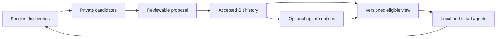

# Shared project memory

**Design date:** 2026-09-22. **Repository examined:** `dad6c6c7dca71eb4fcedce83d799e453d2675765`.

**Status:** Git-sharing runtime implemented and locally validated; identified review findings are closed. Full-repository CI is not green on the development Windows host. The target architecture also specifies optional deployment adapters that are not shipped. [Implementation and evidence](implementation-status.md) distinguishes working code, unsupported profiles and validation claims.

## Intended outcome

One contributor teaches an agent a project fact or decision. The team can inspect and correct that knowledge in Git. A different contributor, machine, model backend or supported Claude Code host can use the accepted knowledge in a fresh session, with its source, branch applicability and freshness visible.

The repository owns durable project knowledge. Claude Code provides the session and tools. The installed plugin can assess and help install the machinery, but uninstalling it must not remove the target repository's memory behavior.

## Read this design

| Question | Document |
|---|---|
| 仓库中的 memory、dream、recall 怎样协作，实际会是什么体验？ | [中文架构图、操作与使用效果](operations-and-experience.zh-CN.md) |
| How is the implementation divided and verified? | [Implementation plan](implementation.md) |
| What is implemented, tested or explicitly unsupported? | [Implementation and evidence](implementation-status.md) |
| What do current official documents and the installed client actually establish? | [Research and evidence](research.md) |
| Which exact release artifacts and official snapshots were inspected? | [Evidence manifest](evidence.json) |
| What are the storage, capture, retrieval, concurrency and lifecycle contracts? | [Architecture](architecture.md) |
| How does it fit the existing harness, and what proves it works? | [Integration and acceptance](integration-and-validation.md) |

## Proposed decisions

1. Git contains individual, reviewable project-memory records; existing authoritative documents remain authoritative.
2. Personal memory, raw transcripts, proposed discoveries and indexes are not silently published with those records.
3. A session reads a versioned view. Its own tentative discoveries and a branch's unmerged changes are labeled separately from accepted team knowledge.
4. Repository-owned scripts, rules and supported host hooks provide the normal path. Native auto memory is an optional capture adapter, not the canonical database.
5. Real-time exchange carries authenticated notices and explicit proposals. Durable acceptance still goes through the repository's configured integration policy.
6. Contradictions, stale evidence and unknown host behavior remain observable states. A timestamp, a model score or a `reviewed_by` string cannot manufacture truth or approval.
7. `dream` maintains knowledge through frozen inputs, traceable synthesis and reviewable proposals. It shares the capture/validation pipeline, while `recall` stays a bounded read operation.

## Delivery boundary

This proposal includes the complete memory lifecycle, local and cloud host integration, parallel worktrees, collaboration transport, migration, observability and release acceptance. It does not claim to recreate Anthropic's private cloud service, recover its original source, or prove behavioral benefit without running the specified evaluations.

The recommended default is Git-based sharing with the repository's ordinary review and merge process. A team can explicitly select an automated acceptance policy for narrowly defined record classes; that policy is versioned and cannot be granted by a memory record itself.

## Validation of this design package

Local document links, the index-to-plan-to-document routes, whitespace/size checks and all eleven saved official-page hashes were verified. The repository's docs-layout and plan-hygiene checks passed. Independent architecture review closed the reported blocking issues; the acceptance document contains 56 specified failure/behavior scenarios, not 56 passing implementation tests.

The existing Windows docs-index gate still reports `docs\\index.md` itself as unrouted. The same failure was reproduced against unchanged `dad6c6c` documentation in a temporary baseline, and the new routes were checked independently. Runtime portability findings and remaining host-version evidence limits are recorded in [research](research.md).

## Consulted

The [research register](research.md) records official URLs, inspected client versions, reproducible static-analysis anchors, repository mechanisms and unresolved evidence boundaries.
