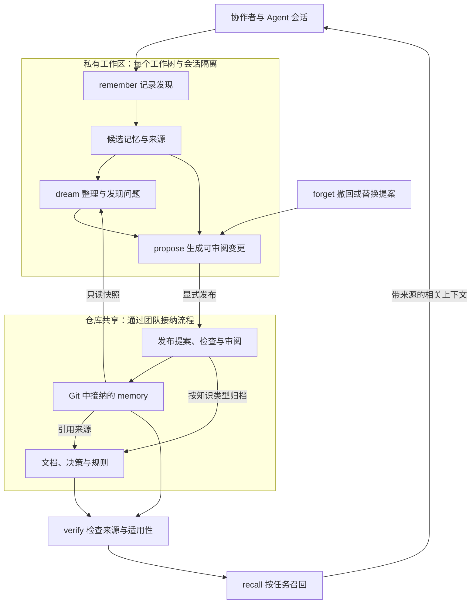
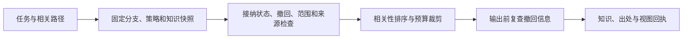

# 仓库记忆：操作、架构与使用效果

这是完整目标设计的中文说明。Git 共享、私有候选、recall、dream、提案与撤回已有实现；实际命令以 [使用指南](../../how-to/shared-memory.md) 为准，[实现与验证记录](implementation-status.md) 列明已实现和未支持的能力。本文中的云端适配、自动整理和效果示例仍是设计说明，不能当作实测结果。存储、权限与并发契约见 [架构](architecture.md)。

下面是通过 [Archify](https://github.com/tt-a1i/archify) 生成、同时放入仓库 README 的实现架构图；后面的流程图解释各个步骤。


## 1. 仓库里的 memory 是什么

每个采用 harness 的仓库拥有自己的项目记忆。它保存已经接纳的决策、约束、操作经验、踩坑原因和资料入口，让新的协作者能够接续工作。已有文档仍然保存完整知识；memory 为它们补充适用范围、来源、版本、有效性和检索入口。

```text
.harness/memory/               随 Git 共享
  config.json                 范围、接纳策略、预算、适配器
  records/<id>.json            每条知识独立审阅、合并和撤回
docs/                         已有事实、决策、操作说明
scripts/memory/               随仓库复制的运行时
.claude/                      仓库内的入口、技能和受支持的 hook

<Git 管理目录>/...            私有，不在可跟踪工作树内
  candidates/                 按工作树和会话隔离的发现
  jobs/                       dream 的快照、输出、来源映射、检查点
  views/                      可以重建的索引和上下文视图
```

私有路径由运行时解析，不能假定 `.git` 总是目录。云端私有存储的持久性必须单独声明。团队共享 Git 中接纳的记录；个人偏好、聊天原文和未发布发现保留在私有域。

## 2. 总体架构



图中有两条速度不同的路径：工作时 `recall` 使用本地索引快速读取；整理时 `dream` 对冻结快照做较慢的批处理。简单明确的候选可以直接进入 `propose`，无需每次先 dream。新机器取得接纳的 Git 版本后，在策略、撤回水位和适用环境相同的条件下，可重建相同的知识视图，不依赖作者机器上的数据库。

## 3. 操作边界

| 操作 | 解决的问题 | 输出与副作用 |
|---|---|---|
| `remember` | 这次学到了什么，值得下次保留？ | 私有候选、来源和适用范围；记录持久性级别 |
| `recall` | 这次任务该知道什么？ | 有限的相关知识、出处、版本及未召回原因；只读 |
| `dream` | 多次工作的发现，怎样整理成可靠知识？ | 去重、矛盾、过期、归档和替换建议；私有输出 |
| `verify` | 来源还在吗，当前版本适用吗？ | 摘要校验、适用性与过期报告；不凭检查时间刷新真实性 |
| `propose` | 哪些内容可以提交给团队？ | 记录及必要文档的 diff、来源映射、验证报告 |
| `forget` | 哪些内容应该停止被使用？ | 按选择清理私有草稿，或生成团队撤回/替换提案 |
| `sync` | 本机知道的团队版本是否更新？ | 从已配置授权来源更新已知版本、撤回信息与失效通知；不自动合并工作分支 |

`inspect` 和 `doctor` 提供状态、兼容性和故障诊断。`reflect` 暂不成为另一套存储或操作：会话回顾属于 `remember` 的候选提取，跨会话整理属于 `dream`。`promote` 的含义由 `propose` 中的归档目标表达，避免多个命令执行同一接纳动作。

### remember：先保留发现，再决定共享

输入包括结论、来源、观察到的代码版本、适用路径和类型。用户明确提出的决定可以直接记录为决定候选；一次测试观测只能证明该次观测，不能被扩写成永久保证。

处理时区分项目知识、个人偏好、临时状态和待验证猜想。个人内容默认不进入团队提案；任务进度继续留在 exec-plan。自动捕获和原生 memory 导入也走同一候选接口，保留原始处理 ID 以消除重复事件。

返回候选 ID、去向、重复关系和持久性回执。创建成功表示已在声明的私有存储中保存，不表示团队已接纳。

### recall：先判断能用，再判断相关



默认只召回当前版本适用的团队知识；本分支提案和本会话发现可以单独查看，始终标明身份。索引命中不等于有权使用。过期摘要不会因为相似度高而重新入选。

排序默认使用明确记录/路径匹配、任务标签和支持 Unicode 的文本检索。可选向量检索或模型排序只能处理已通过资格检查的集合。没有相关知识时返回空结果；查不到来源时报告无法判断。普通召回不需要联网或模型调用。

每条结果说明“为什么出现、适用于哪里、来源是什么、基于哪个版本”。整个响应包含接纳版本、最近已知撤回水位、查询预算和省略数量。沿用主架构的默认预算：启动 4 KiB，单次显式召回 8 KiB，每个上下文周期的自动补充总量 16 KiB；这些是待测的工程默认值。

启动只给简短导航；任务到来时按需召回；修改相关文件前补充路径提示；压缩上下文后重新建立视图。具体自动触发能力以宿主适配测试为准，显式入口始终可用。需要强制遵守的行为进入 guard/gate，不能依赖一次可能被预算省略的召回。

### dream：一次有证据约束的知识整理任务

本设计的 `dream` 是仓库拥有的维护操作；不依赖 Anthropic 托管 Dreams 服务。模型负责提出语义整理建议，确定性运行时负责快照、边界、检查和提案生成。

每个任务固定输入清单：接纳的知识视图、明确选择的本地候选、允许读取的来源、策略版本、最近已知撤回信息。其他人的私有候选不可读取；原始会话必须显式选择才能参与。源文件内容和摘要都记录哈希，输入不随模型运行中途变化。

一次 dream 包括六项工作：

1. **归类与去重。** 区分同一结论的重复记录和不同时间/环境下的独立观测；保留各自的证据。
2. **发现模式。** 从多次失败或纠正中提出更一般的候选结论，列明支持和反例。重复次数和模型信心均不能赋予团队接纳资格。
3. **核对有效性。** 找出失效链接、变更的依赖和过期摘要；来源变化只能触发重新验证，不能证明结论已经反转。
4. **暴露矛盾。** 结构化矛盾由检查器判定；自然语言矛盾作为待审阅问题保留。较新的时间戳不能自行决定谁正确。
5. **建议归档。** 将完整决策归入 docs，将路径约束归入合适的仓库规则；可机械执行的约束可建议 guard/gate。代码和规则改动另走开发检查流程，dream 不执行生成的代码。
6. **生成可比对输出。** 为新增、合并、拆分、替换、待验证和建议撤回分别列出理由、来源与变化。简单压短不能算知识改善。

每个输入记录必须有去向映射：保留、映射到一个或多个输出、保持未解决，或建议撤回并说明理由。每个新结论必须映射到来源；没有足够支持的泛化只能保留为猜想。不得将“在输出中遗漏”解释为已经删除，也不能丢掉适用范围、否定词、例外条件、版本、数值或单位。标识符检查能检测部分丢失，不能证明自然语言含义全部保留，最终仍需审阅。

任务产物存于私有独立目录：输入清单、冻结快照、候选输出、输入/输出映射、语义 diff、检查报告和运行回执。自动校验可以证明格式、引用、部分证据保留和结构化冲突；不能证明模型的推理正确。历史错误的原因可作为有来源的决策保留，但被撤回的敏感正文不能借 dream 回到活跃结果中。

调度状态为 `queued → running → completed | failed | canceled | budget-exhausted`；完成后的结果分别标为 `no-change`、`proposal-ready`、`needs-review` 或 `needs-rebase`。`completed` 仅表示维护任务结束，不表示输出被接纳。取消、失败和预算耗尽保留检查点及诊断，不改写正式记录。

默认手动执行。团队可以配置候选积压、重要合并或定时维护触发，但启用前必须给出本地可用执行器、输入上限、时间/模型费用上限、并发数和冷却时间。hook 只记录待处理事项，不在前台无限启动模型。同一仓库/范围默认单个 dream 作业；输入清单与整理版本相同的重试复用任务身份，不重复发布。调度只能触发维护，不能获得接纳权。

同一逻辑任务的重试与恢复共用累计预算，`budget-exhausted` 不自动重启。外部模型请求结果未知时，先通过执行器支持的幂等键或调用回执核对；无法核对则停在无法判断状态，不盲目重发请求。提高预算是明确的操作，不能借新 job ID 重置原任务的费用限制。

恢复任务前重验冻结输入和当前撤回信息；已经撤回的内容使相关输出失效，并进入清理清单。若使用外部模型，所选输入和费用须符合已配置的调用政策。没有模型执行器时仍可完成确定性检查，语义整理报告不可用，不能冒充完成。

应用整理结果之前再次检查记录、来源和策略的基线。如果同事已经修改其中一项，则标记 `needs-rebase`，重新比对或整理，不能覆盖其修改。正式记录变更仍通过共用的 CAS、完整视图发布和团队接纳流程。已知撤回在输出预览和发布前也要复查。

### verify、forget 与 sync：维护有效性

`verify` 可单独运行，也由 recall 和 dream 复用。它检查来源内容、范围、到期条件和结构化冲突；访问成功的 URL、原样存在的文件都不能替代语义证据。需要重新测试或人工确认时返回下一步，不擅自运行任意来源命令。

`forget` 必须说明作用域：清理自己的草稿，或提议让团队停止召回某条记录。团队撤回保留最小墓碑和可选替代 ID，不保留被撤回正文。目标文档仍包含该事实时，回执必须指出；需要改文档则在提案中一起呈现。Git 历史删除属于单独的历史处理流程。

`sync` 可以刷新已知接纳分支和撤回水位，但不会把新分支事实强加给旧代码。撤回信息对旧分支同样有效；离线使用只能报告最后已知状态。更新通知默认只携带 ID 与摘要哈希，最终知识仍从授权的 Git 来源取得。

## 4. 如何接到现有仓库

现有 `shared/scripts/consolidate.py` 提供 `prepare` 与 `diff`：冻结笔记、独立写候选、检查关键内容丢失和归档去向。其配套技能为 `shared/skills/consolidating-notes/`。这就是 dream 的整理基础，不需要再造一个平行的笔记库。

需要复用其思路并抽取经过测试的公共逻辑，而非把现有命令直接改名：

- 现有默认 `.consolidation/` 在工作树内；新任务必须使用解析后的私有管理目录和唯一 job ID。
- 新任务禁止覆盖已有快照或混入上次候选/会话；输入清单和内容哈希决定可恢复的快照身份。
- 现有文本丢失检查只是辅助信号；增加逐记录来源映射、结构化范围检查、归档目标验证和基线检查。
- 只读文件属性不能作为执行器隔离保证；使用受限写目录能力并校验输入哈希。不支持所需隔离时返回 `unsupported/unjudged`，不启动该执行器；仍可完成确定性检查。
- 旧说明中的“矛盾时偏向较新结论”不能沿用；证据与接纳策略决定处理，时间只提供线索。
- 保留独立笔记整理入口的兼容性。新的 dream 复用 memory 的候选、验证、提案和事务组件，不另建接纳、删除和同步路径。

仓库内的 memory 技能负责解释操作、调用运行时和展示提案；插件继续负责安装与诊断。模型合成属于可选执行器，核心 recall、存储和验证保持 Python 标准库可运行。

## 5. 可能的实际效果

以下使用同一个假想项目，展示预期行为，不是已经运行的演示。

| 时刻 | 人的操作 | 系统应当怎样响应 |
|---|---|---|
| A 修复问题 | “记住：v1 接口必须保留到旧客户端迁移完成。” | 保存带范围和决策来源的私有候选；告知尚未共享 |
| 整理 | “dream 一下最近的项目记忆。” | 将重复发现合并为提案，保留兼容期限；把完整理由归入决策文档 |
| 团队接纳 | 审阅并合并提案 | Git 中形成可追踪的决策入口，新机器能够取得它 |
| B 在新机器工作 | “清理没有新调用方的旧接口。” | recall 带回兼容约束和来源，Agent 将 v1 保留并解释原因 |
| 决策改变 | “迁移完成，批准移除 v1。” | 生成有新依据的替换/撤回提案，接纳后停止把旧约束作为现行知识 |
| C 在旧分支离线 | 尚未取得新撤回信息 | 明示最后同步版本；不能声称知道尚未同步的决策 |

拟议交互可以像这样：

```text
remember → 已保存候选 C17；范围 src/api/**；仅本会话私有。
dream    → C17 与 C23 结论重复；生成一个合并提案，保留两条来源。
propose  → 新决策文档 + 一条 memory 引用；等待仓库接纳流程。
recall   → 保留 v1 兼容入口；适用于当前分支；来源为已接纳决策。
forget   → 已生成旧约束的撤回提案；接纳后影响未来召回。
```

值得验证的效果是减少重复解释、减少再次踩同一坑、让多人使用同一版本的决定，以及及时停止使用过期知识。dream 的价值应通过“整理前后独立工作者表现”验证；文件变少、摘要更顺畅、命中次数变多都不能单独证明效果。验收与实验方案见 [集成与验证](integration-and-validation.md)。
