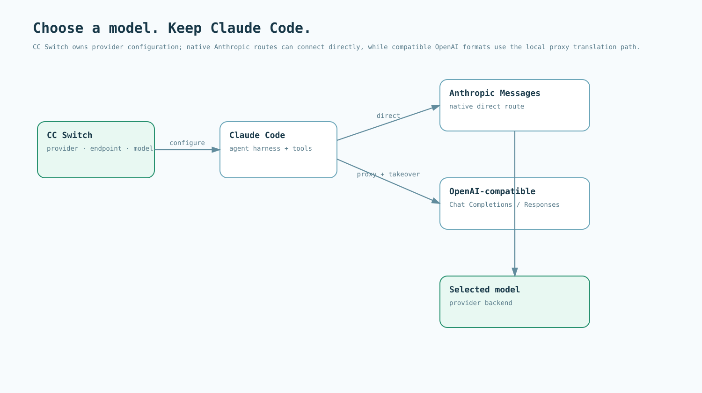

# Model setup with CC Switch

**Default stack: CC Switch + Claude Code + cc-repo-harness.** Choose the backend in CC Switch; keep the agent harness and repository workflow in Claude Code.

## Install the workstation tools

Install Claude Code using its [official quick start](https://code.claude.com/docs/en/quickstart), and install CC Switch from its [official releases](https://github.com/farion1231/cc-switch/releases/latest). In CC Switch, select the **Claude Code** application.

CC Switch is a workstation tool. This repository documents the setup; it does not vendor CC Switch or commit provider credentials.

## Add the provider and model

Create a provider using a preset or a custom configuration. Set the endpoint, authentication, and model IDs supplied by that provider. Resolve every role you plan to use, including subagent models, to a model the endpoint serves.

Do not copy a model ID from an unrelated provider. Verify the selected model against the provider's own catalog.

## Select the matching API format

| Upstream format | Claude Code connection |
|---|---|
| Anthropic Messages | Configure the native endpoint directly, or forward it through the proxy. |
| OpenAI Chat Completions | Select Chat Completions in CC Switch, run the local proxy, and enable Claude Code takeover. |
| OpenAI Responses | Select Responses in CC Switch, run the local proxy, and enable Claude Code takeover. |

With takeover enabled, the runtime request direction is **Claude Code → CC Switch local proxy → selected provider**. Responses return through the same proxy. Keep the proxy running while using a translation route; a native direct route does not need translation.

Start a new Claude Code session after changing provider settings. Use the address shown by your local CC Switch installation rather than hard-coding a port in the repository.



## Verify tool use

In a trusted checkout, ask Claude Code:

```text
Read README.md from disk and report its first heading.
Run git status --short and report the result.
Do not edit any files. Stop after these two checks.
```

Confirm that the session actually made a file-read call and a shell call and consumed their results. A prose-only answer does not validate tool use. Check the configured provider/model using the client or proxy request information, not the model's self-description.

Then install the plugin and run `/assess` as shown in the root README. Before using optional Room or WikiSkill runtimes, also verify MCP tool invocation and the model capabilities required by those workflows.

## Keep comparisons reproducible

For cross-model evaluations, record the provider, exact model ID, API format, direct/proxy route, CC Switch version, Claude Code version, repository commit, tool permissions, and relevant generation settings. Keep the task and repository setup fixed when comparing model backends.

Keep API keys, exported provider credentials, and local proxy logs out of Git and the public documentation build.

## Upstream references

- [CC Switch](https://github.com/farion1231/cc-switch)
- [Claude Code quick start](https://code.claude.com/docs/en/quickstart)

This page defines the default onboarding path for cc-repo-harness.
