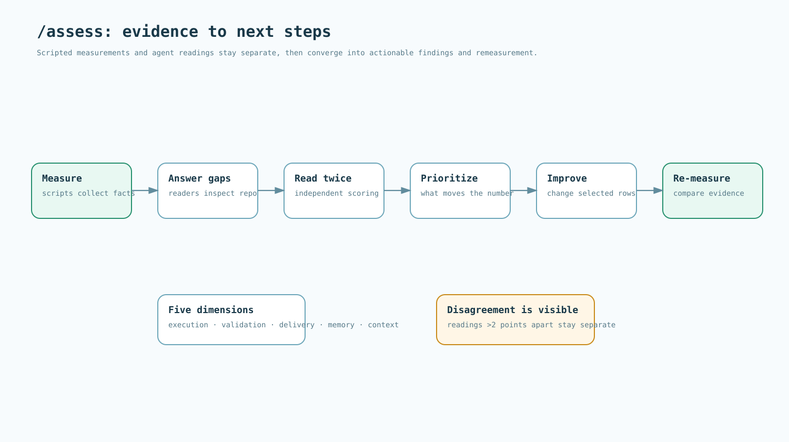
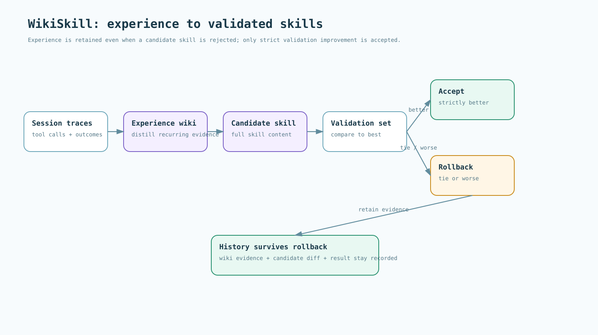
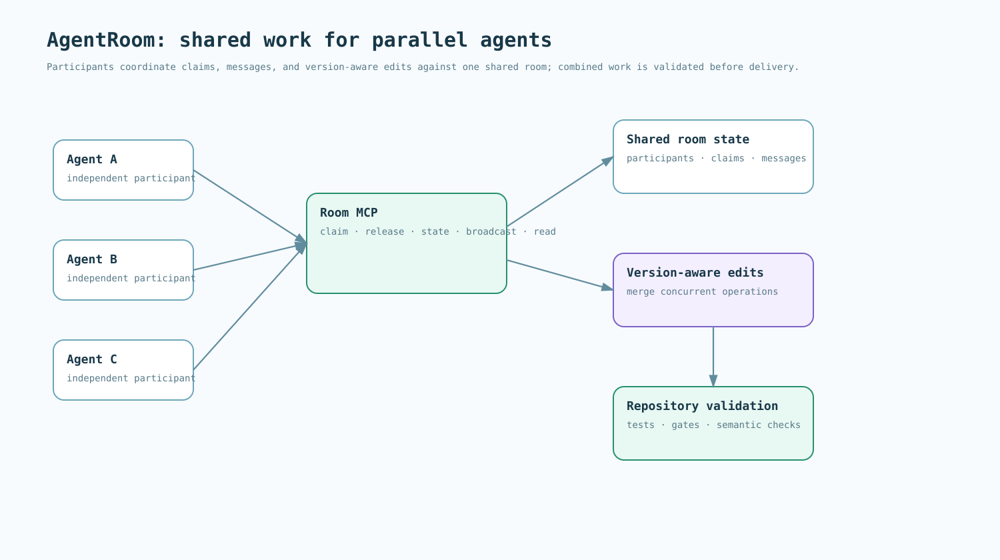

# Visual guide

The first two diagrams are the README overview. The remaining diagrams explain one mechanism at a time. All labels are in English, and each SVG adapts to the viewer's light or dark theme.

## Your model. Your project. One development workflow.

Connect provider choice, project knowledge, guards, checks, assessment, and learning.

## One task, supported from context to delivery

Put context and checks at the moments when they support development.

## /assess: evidence to next steps

Separate scripted measurements from agent judgments and close the loop with remeasurement.

## WikiSkill: experience to validated skills

Trace evidence, propose skills, validate strict improvement, and retain experience through rollback.

**Status:** implementation preview.

## AgentRoom: shared work

Coordinate participants and version-aware edits; validate the combined result.

**Status:** implementation preview.

## Choose a model. Keep Claude Code.

Separate provider configuration from the optional runtime translation route.

